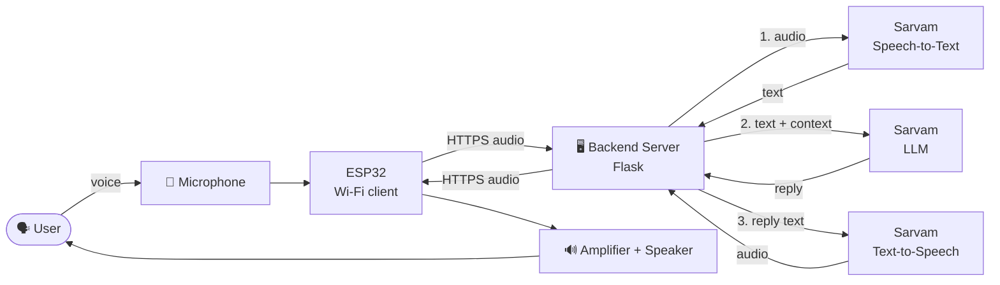
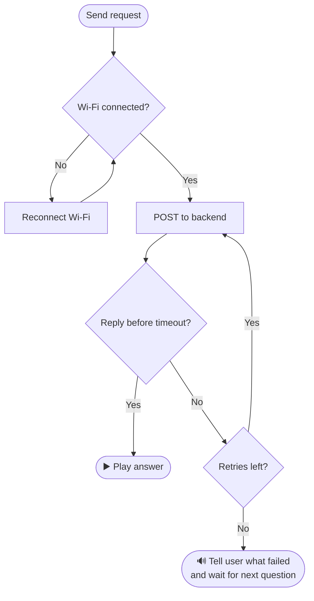

<div align="center">


# 🎙️ victor-AI-Assistance
### Voice-Interactive AI Chatbot built on the ESP32 with a remote AI backend

**Listen · Send · Think · Speak**


</div>

---

## 📑 Table of Contents

1. [Project Overview](#-project-overview)
2. [Team Wishper](#-team-wishper)
3. [Objectives](#-project-objectives)
4. [Hardware](#-hardware)
5. [System Architecture](#-system-architecture)
6. [Main Features](#-main-features)
7. [Sarvam AI Integration & API Key](#-sarvam-ai-integration--api-key)
8. [Getting Started](#-getting-started)
9. [Project Structure](#-project-structure)
10. [AI Usage Declaration](#-ai-usage-declaration)
11. [Networking Concepts](#-networking-concepts-used)
12. [Latency Measurement](#-latency-measurement)
13. [Error Handling](#-error-handling)
14. [Demonstration](#-expected-demonstration)
15. [Conclusion](#-conclusion)

---

## 🚀 Project Overview

This project turns an **ESP32** into a small talking assistant. You ask a question into a microphone, the request travels over Wi‑Fi to a remote AI service, and the answer comes back as speech through an amplifier and speaker.

The ESP32 does very little thinking. It records audio, keeps a stable network connection and hands the request to a backend server. **Speech recognition, the language model and speech synthesis all run on remote [Sarvam AI](https://www.sarvam.ai/) services.** A low‑cost board can offer AI features as long as the heavy work happens somewhere else.

<div align="center">

| 🧩 1 | ☁️ 3 | ⏱️ 7 | 🎯 10 |
|:---:|:---:|:---:|:---:|
| **ESP32 client** | **Remote AI services** | **Latency stages** | **Project objectives** |

</div>

| | |
|---|---|
| **Project title** | Voice-Interactive AI Chatbot using ESP32 and Remote AI |
| **Controller** | ESP32 development board acting as a Wi‑Fi client |
| **Input** | Microphone, with an optional push button to start listening |
| **Output** | Amplifier and speaker |
| **AI processing** | Sarvam AI: speech recognition, response generation, text‑to‑speech |
| **What we measure** | Reliability under network problems and end‑to‑end latency |

---

## 👥 Team Wishper

<div align="center">

| # | Team Member | GitHub |
|:-:|---|---|
| 1 | **Tathastu Agarwala** | [@TathastuAgarwala](https://github.com/TathastuAgarwala) |
| 2 | **Arth Parashar** | – |
| 3 | **Abhisekh Nayak** | – |
| 4 | **Akhand Pratap Singh** | – |

</div>

---

## 🎯 Project Objectives

| # | Objective | # | Objective |
|:-:|---|:-:|---|
| 1 | Capture voice from the user | 6 | Convert the response into speech |
| 2 | Connect to the Internet using ESP32 Wi‑Fi | 7 | Play the response through a speaker |
| 3 | Send the voice data to a remote backend | 8 | Handle network failures and slow responses |
| 4 | Use a remote AI service to understand the request | 9 | Support short back‑and‑forth conversations |
| 5 | Generate an AI response | 10 | Measure latency of the complete interaction |

---

## 🔧 Hardware

| Component | Purpose |
|---|---|
| 🧠 **ESP32 board** | Main controller. Connects to Wi‑Fi and exchanges data with the backend |
| 🎤 **Microphone** | Captures the user's voice |
| 🔊 **Amplifier + speaker** | Amplifies and plays the spoken answer |
| 🔘 **Push button** *(optional)* | Starts a voice capture on demand |
| 🔌 **Jumper wires** | Connect the microphone and button to the ESP32 |
| 🔋 **USB cable** | Powers the board and is used for programming |

---

## 🏗️ System Architecture

A straightforward client‑server design. The ESP32 handles everything physical and network related, while the backend coordinates the Sarvam AI services.


<p align="center"><em>Figure 1: End‑to‑end flow of one voice interaction</em></p>

### Step by step

| Step | What happens |
|:-:|---|
| 1 | The user speaks into the microphone, optionally after pressing the push button |
| 2 | The ESP32 captures and buffers the voice data |
| 3 | The voice data is sent over Wi‑Fi to the backend using HTTP/HTTPS |
| 4 | The backend has Sarvam turn the speech into text |
| 5 | The text, with recent conversation context, goes to the AI model which writes a reply |
| 6 | A text‑to‑speech service turns the reply into audio |
| 7 | The audio is returned to the ESP32 |
| 8 | The ESP32 sends the audio to the amplifier, which drives the speaker |

### Who does what

| ESP32 | Backend server | Remote AI (Sarvam) |
|---|---|---|
| Voice capture | Receives ESP32 requests | Speech recognition |
| Wi‑Fi connection | Authentication | Response generation |
| Sending requests | Calls the AI and TTS services | Speech synthesis |
| Receiving audio | Keeps recent conversation context | |
| Audio output | Holds the **Sarvam API key** | |
| Timeouts, retries, timing | | |

---

## ✨ Main Features

| Feature | Description |
|---|---|
| 🎤 **Voice input** | A connected microphone picks up the question; an optional push button starts recording |
| 📶 **Wi‑Fi communication** | The ESP32 joins a Wi‑Fi network and talks to the backend over the Internet |
| 🧠 **Remote AI processing** | Requests go to Sarvam AI. The ESP32 never runs the model itself |
| 🔊 **Voice response** | The AI reply is converted to audio and played on the speaker |
| 💬 **Short conversations** | Remembers the last few turns so follow‑ups work without repeating the subject |
| 🛡️ **Network failure handling** | Connection checks, timeouts, limited retries and Wi‑Fi reconnection |
| ⏱️ **Latency measurement** | Per‑stage timing and total end‑to‑end latency are reported |

### 💬 Example conversation

> **YOU:** What is KIIT?
> **VICTOR:** KIIT is a university in Bhubaneswar.
>
> **YOU:** Where is it located?
> **VICTOR:** It is located in Bhubaneswar, Odisha.

---

## 🔑 Sarvam AI Integration & API Key

We use the **[Sarvam AI](https://docs.sarvam.ai/)** API for all three AI tasks:

| Task | Sarvam endpoint | Default model |
|---|---|---|
| 🎤 Speech‑to‑Text | `POST /speech-to-text` | `saarika:v2.5` |
| 🧠 Chat / reply | `POST /v1/chat/completions` | `sarvam-m` |
| 🔊 Text‑to‑Speech | `POST /text-to-speech` | `bulbul:v2` |

All requests are authenticated with the `api-subscription-key` header. The key lives **only in the server code environment**, never on the ESP32 and never in Git.

### Add your API key

1. Create a free key at the [Sarvam dashboard](https://dashboard.sarvam.ai).
2. In the `server/` folder, copy the example file:
   ```bash
   cp .env.example .env
   ```
3. Open `server/.env` and paste your key:
   ```env
   SARVAM_API_KEY=your_real_key_here
   DEVICE_TOKEN=a_long_random_secret
   ```
4. `server/server.py` reads it automatically:
   ```python
   SARVAM_API_KEY = os.getenv("SARVAM_API_KEY", "")   # loaded from server/.env
   HEADERS = {"api-subscription-key": SARVAM_API_KEY}
   ```

> [!WARNING]
> **Never commit your real API key.** `.env` is already listed in `.gitignore`. If a key is ever pushed to GitHub, revoke it in the Sarvam dashboard and create a new one.

---

## ⚡ Getting Started

```bash
# 1. Clone
git clone https://github.com/TathastuAgarwala/victor-AI-Assistance.git
cd victor-AI-Assistance/server

# 2. Install dependencies
python -m venv .venv
source .venv/bin/activate        # Windows: .venv\Scripts\activate
pip install -r requirements.txt

# 3. Add your Sarvam API key (see section above)
cp .env.example .env

# 4. Run the backend
python server.py
```

Check it is alive: open `http://<server-ip>:5000/health`, you should see `{"status":"ok"}`.

On the ESP32, set the Wi‑Fi credentials, the server URL (`http://<server-ip>:5000/ask`) and the same `DEVICE_TOKEN`, then flash the firmware from the Arduino IDE.

---

## 📁 Project Structure

```text
victor-AI-Assistance/
├── assets/
│   └── banner.svg          # README banner
├── server/
│   ├── server.py           # Flask backend (Sarvam STT -> LLM -> TTS)
│   ├── requirements.txt
│   └── .env.example        # copy to .env and add SARVAM_API_KEY
├── firmware/               # ESP32 Arduino code (add yours here)
├── .gitignore
└── README.md
```

---

## 🤖 AI Usage Declaration

AI is used in this project for four declared purposes and nothing else.

| # | Purpose | Description |
|:-:|---|---|
| 1 | **Speech recognition** | Sarvam converts the user's voice into text |
| 2 | **Response generation** | Sarvam's language model writes a conversational reply |
| 3 | **Text‑to‑speech** | Sarvam speech synthesis turns the reply into audio |
| 4 | **Development assistance** | AI tools may help us understand concepts, debug errors, read API docs and spot mistakes |

> [!NOTE]
> The final system design, integration, testing and demonstration are performed and verified by the project team. No additional AI functionality outside these declared uses will be added.

---

## 🌐 Networking Concepts Used

| Concept | How it is used |
|---|---|
| **Wi‑Fi networking** | The ESP32 joins a Wi‑Fi network to reach the Internet |
| **Client‑server model** | ESP32 is the client, the backend is the server |
| **IP communication** | Data moves between device and backend using IP addressing |
| **HTTP / HTTPS** | Carries the audio up and the reply back |
| **REST APIs** | The backend calls Sarvam's speech and chat APIs |
| **Request‑response** | One voice query is one request, the spoken answer is the response |
| **Authentication** | Device token to the backend, API key to Sarvam |
| **Timeouts** | Stop the device waiting forever on a slow server |
| **Retry mechanism** | Failed requests are retried a limited number of times |
| **Data buffering** | Voice and audio are buffered during capture and playback |
| **Network latency** | Measured at every stage of the interaction |
| **Error handling** | Failures are detected and reported, never left hanging |

---

## ⏱️ Latency Measurement

Every interaction is timed stage by stage to see where the delay comes from.

```mermaid
gantt
    title Figure 2: Seven stages of end-to-end latency
    dateFormat X
    axisFormat %s
    section ESP32
    t1 Voice capture      :a1, 0, 3
    t2 Network transfer   :a2, after a1, 1
    section Sarvam
    t3 Speech processing  :a3, after a2, 2
    t4 AI response        :a4, after a3, 2
    t5 Text-to-speech     :a5, after a4, 2
    section ESP32
    t6 Audio transfer     :a6, after a5, 1
    t7 Playback           :a7, after a6, 3
```


<p align="center"><em>Illustrative durations only</em></p>

| No. | Stage | What is measured |
|:-:|---|---|
| **t1** | Voice capture | Time taken to record the user's request |
| **t2** | Network transfer | Time to send voice data from ESP32 to backend |
| **t3** | Speech processing | Time Sarvam needs to turn speech into text |
| **t4** | AI response | Time the model needs to generate the reply |
| **t5** | Text‑to‑speech | Time to convert the reply text into audio |
| **t6** | Audio transfer | Time to return the audio to the ESP32 |
| **t7** | Playback | Time the speaker takes to play the answer |

> **Reported result:** total end‑to‑end latency = `t1 + t2 + t3 + t4 + t5 + t6 + t7`, reported for every demonstrated interaction. The server returns t3–t5 in the `X-Timings` response header.

---

## 🛡️ Error Handling

The device must never get stuck when the network or server misbehaves.


<p align="center"><em>Figure 3: Error handling and retry logic</em></p>

| Situation | Behaviour |
|---|---|
| 📴 **Wi‑Fi drops** | The ESP32 tries to reconnect, then re‑checks the connection before sending |
| 🐢 **Slow server** | If no reply arrives within the timeout, the request is retried a limited number of times |
| ❌ **Still failing** | The user is told what happened and the device returns to waiting |

---

## 🎬 Expected Demonstration

| # | Step | # | Step |
|:-:|---|:-:|---|
| 1 | ESP32 connecting to Wi‑Fi | 6 | Amplifier and speaker playing the response |
| 2 | User asking a question | 7 | Follow‑up question using conversation context |
| 3 | Voice sent to the backend | 8 | Network interruption and graceful recovery |
| 4 | AI generating a response | 9 | Latency measurements |
| 5 | Response converted to speech | | |

---

## 🏁 Expected Outcome & Conclusion

The result is a compact voice assistant that shows how an embedded system can talk to a remote AI service over a real network and still feel smooth and interactive.

`Embedded Systems` · `Computer Networks` · `IoT` · `Cloud API` · `Artificial Intelligence`

The ESP32 takes care of the physical interface and the network link, while the backend and Sarvam AI carry the heavy computation. The finished system offers voice input, remote AI processing, spoken output, follow‑up conversation, network failure handling and latency measurement in one small device.

---

<div align="center">

⭐ **If you like this project, give it a star!** ⭐

**Team Wishper** · Tathastu Agarwala · Arth Parashar · Abhisekh Nayak · Akhand Pratap Singh

</div>
